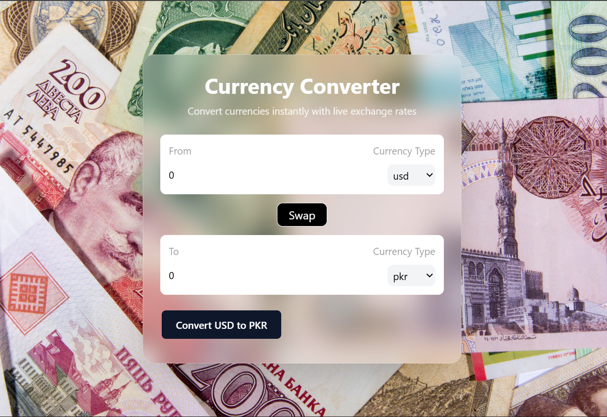

# 💱 Currency Converter

A modern and responsive Currency Converter web application built with **React** and **Tailwind CSS**. It allows users to convert currencies using live exchange rates fetched from a currency API.

## 🚀 Features

* 🌍 Convert between multiple currencies
* 🔄 Swap currencies with a single click
* ⚡ Live exchange rates
* 📱 Fully responsive design
* 🎨 Modern UI with Tailwind CSS
* ⚛️ Built using React Hooks

## 🛠️ Tech Stack

* React
* Vite
* JavaScript (ES6+)
* Tailwind CSS
* Currency Exchange API

## 🔗 Live Demo

https://currency-converter-ten-taupe-33.vercel.app/

## 📂 GitHub Repository

https://github.com/ahmed0-17/Currency-converter

## 📦 Installation

Clone the repository:

```bash
git clone https://github.com/ahmed0-17/Currency-converter.git
```

Go to the project folder:

```bash
cd Currency-converter
```

Install dependencies:

```bash
npm install
```

Start the development server:

```bash
npm run dev
```

## 📸 Screenshot




## 👨‍💻 Author

Ahmed Ali
